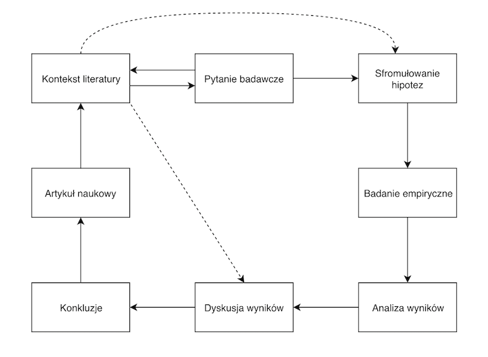

# Metodologia badań psychologicznych 2

Ćwiczenia

Krzysztof Basiński

---

# Zasady na ćwiczeniach/laboratoriach

* Można nie być _dwa razy_
* Nie zmieniajcie grup
* Nie spóźniajcie się
* Z tygodnia na tydzień będą zadania. Jeśli ktoś się nie wywiąże, obetnę mu punkty za projekt

---

# Projekt

* Badanie eksperymentalne
* W planie złożonym 2x2
* Nie może budzić **jakichkolwiek** wątpliwości etycznych (minimalna szkodliwość)
* Musi być możliwe do zrealizowania przez studentów 2 roku
* Badanie "na żywo" (przez internet w bardzo uzasadnionych przypadkach lub jeśli sytuacja pandemiczna się pogorszy)

---

# Efekty projektu

* Przeprowadzone badanie
* Zanalizowane wyniki
* Artykuł naukowy, opisujący wyniki badania
* Prezentacja na ostatnich zajęciach

---

# Narzędzia

* PsychoPy
* <www.psychopy.org>
* <https://workshops.psychopy.org/teaching/>
* Zadanie domowe:
  * Zainstaluj PsychoPy
  * Zobacz (Jason Ozubko - Getting Started with PsychoPy, Part 1)[https://www.youtube.com/watch?v=GSv60zgQlB8&list=PL6PJquR5BWXllUt585cRJWcRTly55iXTm&index=1]

---

# Co? gdzie? kiedy?

---

# Proces badawczy - powtórzenie

---

# Zastanów się...

* W jaki sposób dokonać przeglądu literatury?
* Jakich narzędzi użyć?
* Na co trzeba uważać?

---

# Zadanie

* W 3-4 osobowych grupach 
* Postawcie (dowolne) pytanie badawcze
* Zróbcie (ekspresowy) przegląd literatury
* Znajdźcie co najmniej trzy artykuły
* Zaprezentujcie, co jest w tych artykułach
* Zróbcie podsumowanie i spróbujcie odpowiedzieć na pytanie badawcze