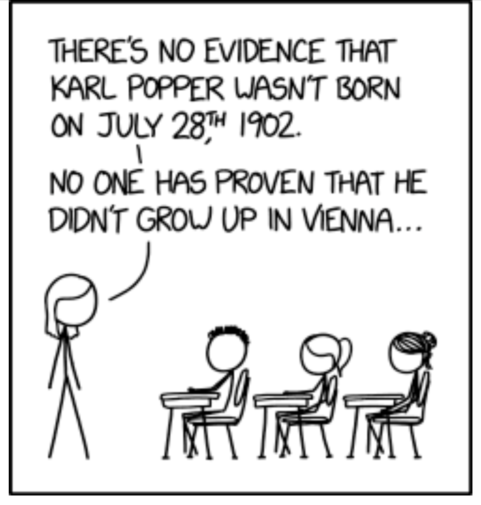

# Powtórka z zeszłego roku

---

# Nauka

...?

---

# Psychologia jako **nauka** _empiryczna_

**Empiria - doświadczenie, poznanie za pośrednictwem zmysłów** (SJP)

---

# Psychologia jako nauka empiryczna

* Psycholog polega na badaniach empirycznych w wyciąganiu wniosków nt. zachowania ludzi
* Badania empiryczne oparte są na danych zbieranych i analizowanych w systematyczny sposób
* Zasady regulujące w jaki sposób naukowcy zbierają i analizują dane zbiorczo nazywane są metodą naukową

---

# Teorie naukowe

* Teoria naukowa – zestaw reguł, które wyjaśniają i pozwalają przewidywać wiele (lecz nie wszystkie) zjawiska w jakiejś dziedzinie
* Dobra teoria naukowa powinna:
  1. Być ogólna
  2. Być oszczędna
  3. Stymulować dalsze badania
  4. Być falsyfikowalna

---

# Falsyfikacjonizm

---

# Falsyfikacjonizm

* Karl Popper, Austria/UK, I poł. XXw.
* Teoria jest naukowa wtedy, gdy istnieje *hipotetyczna możliwość dowiedzenia jej nieprawdziwości*
* Np. teoria „wszystkie łabędzie są białe” jest... 
* ...falsyfikowalna.

---

# Praca naukowa jako weryfikowanie hipotez

* Empirycznej weryfikacji teorii dokonuje się poprzez weryfikowanie hipotez wysnutych na jej podstawie 
* Hipoteza – proponowane wyjaśnienie jakiegoś zjawiska, sformułowane na podstawie teorii naukowej i testowalne przy pomocy badań empirycznych
* Hipoteza najczęściej postuluje jakiś związek pomiędzy zmiennymi
* Jeśli hipotezy wysnute z teorii potwierdzane są w badaniach, to teoria jest dobrą teorią naukową…
* …ale…

---

# Nauka z perspektywy kurczaków czyli problem indukcji

* Kurczak co rano obserwuje jak hodowca przychodzi i wydaje jedzenie
* Na mocy indukcji kurczak stwierdza, iż prawdziwe jest zdanie „hodowca każdego dnia przychodzi wydać jedzenie”
* Problem – pewnego dnia hodowca przychodzi i ukręca łeb kurczakowi
* Czy można orzec o prawdziwości teorii na podstawie danych empirycznych, które ją potwierdzają?

---

# Proces badawczy - powtórzenie

---

# Etyka w badaniach

* Przestrzeganie kodeksów etycznych
* Unikanie plagiatów i auto-plagiatów
* Problemy świadomej zgody
* Etyczne raportowanie wyników badań
* Przechowywanie i dzielenie się danymi „surowymi”
* Problem dublowania publikacji i dzielenia ich na części

---

# Kodeksy etyczne

- Kodeks PTP
- Kodeks APA
- Kodeks NCN

---

# Pomiar

---

# Zmienne

* Zmienna - jakakolwiek własność lub cecha, która przyjmuje różne wartości u różnych ludzi, w różnych sytuacjach etc.
* Przykłady:
    * Wiek
    * Płeć
    * Nastrój
    * Agresywność
    * Inteligencja
    * Neurotyzm

---

# Operacjonalizacja zmiennej

* Nie wszystkie pojęcia (zmienne konceptualne) można wprost badać empirycznie
* Przykłady - inteligencja, osobowość, poczucie kontroli
* Operacjonalizacja to **definiowanie zmiennej przez pryzmat obiektywnych, empirycznych wskaźników** (np. wynik testu na inteligencję)
* Definicja operacyjna: np. inteligencja = wynik testu Wechslera

---

# Wyzwania w operacjonalizacji

* Ta sama zmienna może mieć **różne** operacjonalizacje
* Np. inteligencja: test Ravena vs. test Wechslera
* Czy to ta sama inteligencja?
* Np. pomiar zdrowia w medycynie, psychologii zdrowia
* Np. lęk w psychologii, psychiatrii i modelach zwierzęcych
* Problem sięga dalej niż psychologia (np. w fizyce wiele fenomenów obserwujemy nie wprost lecz w oparciu np. o odbite światło)

---

# Typy zmiennych

* Zmienne jakościowe
* Zmienne ilościowe

---

# Typy skal pomiarowych

* Skale kategorialne (*categorial*)
* Skale ciągłe (*continous*)

---

# Skale kategorialne: typy

* Nominalna
* Dychotomiczna
* Porządkowa

---

# Skala nominalna

* Skala nominalna (*nominal*) – dwie lub więcej kategorii, jednak kategorie są **nieuporządkowane**
* Przykłady:
  * Płeć
  * Wykształcenie (?)
  * Kolor skóry (?)
  * Grupa społeczna (?)
  * Typ osobowości (???)

---

# Skala dychotomiczna

* Skala dychotomiczna (*dichotomous*) – specjalny rodzaj nominalnej, przybiera tylko **dwie**, przeciwstawne kategorie
* Przykłady:
  * Płeć (?)
  * Przynależność do grupy społecznej (np. muzycy vs. niemuzycy)
  * Czynnik genetyczny vs. środowiskowy (?)
  * Wiek (w kategoriach dorosły vs. dziecko)
* Dychotomiczność może zależeć od badanej **populacji** (np. jeśli populacją w badaniu są np. Polacy i Rosjanie (i nikt inny), to narodowość jest dychotomiczna)

---

# Skala porządkowa

* Skala porządkowa (*ordinal*)– kategorie można uporządkować, jednak nie można wykonywać na nich obliczeń
* Przykłady:
  * Wykształcenie (ale uwaga!)
  * Miejsce w zawodach sportowych
  * **Przedział** wieku (np. 20-29, 30-39, itp)
  * Pojedyncza skala Likerta

---

# Skale ciągłe: typy

* Skala przedziałowa
* Skala ilorazowa/stosunkowa

---

# Skala przedziałowa

* Skala przedziałowa (*interval*) – zmienna przybiera wymierne wartości, które można porównywać.
* Nie ma sensownego punktu zerowego. Nie możemy powiedzieć, że czegoś jest "dwa razy więcej"
* Przykłady:
  * Zdolności szkolne (mierzone wynikiem na maturze)
  * Wynik **kwestionariusza psychologicznego** z pytaniami na skali Likerta (z wielu pozycji)
  * Temperatura (w Celsiuszach)

---

# Skala ilorazowa

* Skala ilorazowa, stosunkowa (*ratio*) – zmienna przedziałowa z punktem zerowym (można powiedzieć, że czegoś jest np. „dwa razy więcej”)
* Przykłady:
  * Wzrost, waga, większość wartości fizycznych (temperatura w Kelwinach)
  * Ilość instancji zachowania (np. w analizie behawioralnej)
  * Wyniki metod neuroobrazowania (choć ostrożnie!)

---

# Rzetelność i trafność pomiaru

---

# Trafność

Czy metoda mierzy to, co ma mierzyć?

---

# Trafność

* Jak ma się wynik pomiaru to **prawdziwego poziomu zmiennej**?
* Jak ma się wynik pomiaru do **teorii psychologicznej**?

---

# Trafność - przykłady

* Wzrost
* Prędkość
* Kolor skóry
* Inteligencja
* Osobowość

---

# Jak zbadać trafność? Przykładowe sposoby

* Trafność diagnostyczna i prognostyczna
* Trafność zbieżna i różnicowa
* Trafność fasadowa

---

# Trafność diagnostyczna

* Czy możemy na podstawie wyniku pomiaru postawić "diagnozę" (przewidywać jak jest)?
* Np. wynik matury z polskiego różnicuje klasy humanistyczne i mat-fiz (różnicuje?)
* Czy możemy na podstawie wyniku pomiaru przewidywać przyszłość (dokonać prognozy)?
* Np. wynik z matury z matematyki prognozuje wyniki na studiach (prognozuje?)
* Inne przykłady: cechy osobowości a zaburzenia psychiczne, inteligencja a zarobki itd.

---

# Trafność zbieżna i różnicowa

* Czy wynik testu jest wysoko skorelowany z wynikiem innego, trafnego testu mierzącego to samo? (trafność zbieżna)
* Czy wynik testu nie koreluje z wynikiem innego, trafnego testu mierzącego inną, teoretycznie nieskorelowaną zmienną? (trafność różnicowa)

---

# Trafność fasadowa

* Czy badacze/sędziowie kompetentni zgadzają się, że dany test mierzy to co powinien mierzyć?
* Czy osoby badane są przekonane, że test mierzy to co powinien mierzyć?

---

# Problemy z trafnością w psychologii i innych naukach

* Czy **w ogóle** jesteśmy w stanie określić trafność pomiaru dla konstruktów psychologicznych?
* Wiele teorii, wiele metod... wiele psychologii?
* Kwestionariusze, testologia i słabości teorii psychologicznych (wszystko koreluje ze wszystkim!)
* W neuronauce - czy fMRI rzeczywiście mierzy aktywność mózgu?

---

# Rzetelność

Czy test **dobrze** (rzetelnie) mierzy to co ma mierzyć?

---

# Rzetelność - proste przykłady

* Zważ się dwa razy na tej samej wadze. Czy ważysz tyle samo?
* Jaka jest temperatura za oknem? Jak zmienia się, w zależności od tego czy na termometr świeci słońce?
* Jaka jest temperatura twojego ciała? Jak zmienia się, w zależności od tego jak ją zmierzysz?

---

# Ogólny model rzetelności

* Wynik pomiaru zależy od prawdziwej wartości zmiennej
* Wynik pomiaru zależy też od błędu, wynikającego z niedoskonałości metody pomiaru bądź innych czynników
* Równanie klasycznej teorii testów:

$$ wynik testu = wynik prawdziwy + błąd $$

---

# Błąd pomiaru

* Błąd może być losowy
* Błąd może być systematyczny
* Średnia błędu losowego dąży do 0
* W praktyce często z błędem da się żyć, jeżeli jesteśmy w stanie go **oszacować**

---

# Metody badania rzetelności

* Test-retest: czy dwa pomiary tym samym testem w różnym czasie dadzą ten sam wynik?
* Zgodność wewnętrzna: czy poszczególne pozycje w kwestionariuszu mierzą ten sam konstrukt?

---

# Uwagi końcowe

* Trafność i rzetelność to nie tylko problemy testów psychologicznych
* Test wysoce rzetelny może być kompletnie nietrafny. 
* Test trafny może być kompletnie nierzetelny.