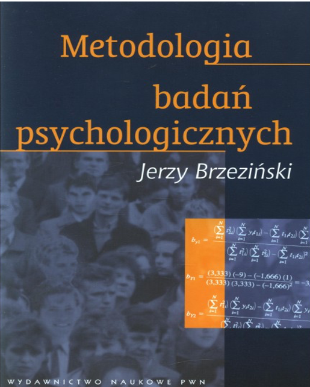

# Metodologia badań psychologicznych 2

Wykłady

Krzysztof Basiński

---

# Kontakt

* E-mail: k.basinski@gumed.edu.pl
* kbas.gumed.edu.pl
* kbas.gumed.edu.pl/mbp2

---

# Organizacja

* Wykłady (na Zoomie) w piątki, 8:45 - 10:15, cały semestr
* Ćwiczenia (na Zoomie) w poniedziałki, 13.00 - 15.15  (4.10.2021, 11.10.2021)
* Laboratoria (na żywo) w pozostałe poniedziałki do końca semestru:
  gr. C: 8.45 - 10.15 
  gr. A: 10.30 - 12.00
  gr. B: 13.00 - 15.15

---

# Co będziemy robić?

* Będziemy uczyć się o eksperymentach
* Będziemy robić eksperymenty
* Będziemy uczyć się opisywać eksperymenty w artykułach

---

# Warunki zaliczenia

* 2 kolokwia (2 * 15% = 30% oceny)
* Projekt zaliczeniowy (40% oceny)
* Egzamin (30% oceny)
* Punkty za ogólną bystrość

---

# 2 Kolokwia

* Pierwsze 11.10 na ćwiczeniach (via Moodle)
* Drugie gdzieś w połowie semestru
* Jeśli ktoś będzie miał mniej niż 60% punktów z obu kolokwiów łącznie, musi napisać zbója

---

# Egzamin

* Pisemny, mam nadzieję, że na żywo
* Bardzo mocno problemowy - będziecie analizować badania, proponować własne metodologie, interpretować wyniki i wyciągać wnioski

---

# Projekt

* W grupach przygotujecie własne badanie eksperymenalne i opiszecie jego wyniki w artykule
* Szczegóły omówimy na ćwiczeniach

---

# Podręczniki

---

# Podręczniki

---

# Podręczniki

---

# Podręczniki

