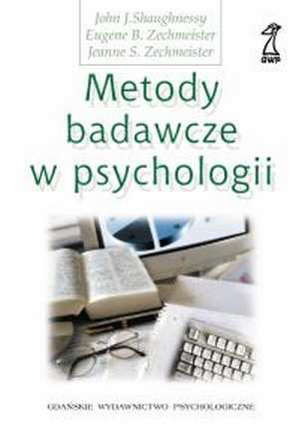
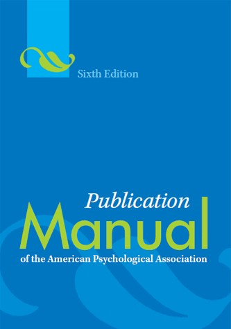

# Metodologia badań psychologicznych 2

Wykłady

Krzysztof Basiński

---

# Kontakt

* E-mail: k.basinski@gumed.edu.pl
* kbas.gumed.edu.pl/mbp2

---

# Organizacja

- Wykłady w piątki, 8:45 - 10:15, cały semestr, CBM_C.
- Ćwiczenia, sala seminaryjna nr 2/DD/09 (CMI):
  - 15.45 - 18.00
  - gr. A (2.10.2024, 16.10.2024)
  - gr. B (9.10.2024, 23.10.2024)
- Laboratoria, sala seminaryjna nr 2/DD/09 (CMI):
  - gr. A 8.00 - 9.30
  - gr. B 9.45 - 11.15
  - gr. C 11.30 - 13.00

---

# Co będziemy robić?

* Będziemy uczyć się o eksperymentach
* Będziemy robić eksperymenty
* Będziemy uczyć się opisywać eksperymenty w artykułach

---

---

# Warunki zaliczenia

* 2 kolokwia (2 * 15% = 30% oceny)
* Projekt zaliczeniowy (40% oceny)
* Egzamin (30% oceny)
* Punkty za ogólną bystrość

---

# 2 Kolokwia

* Pierwsze na wykładzie - powtórka z zeszłego roku
* Drugie gdzieś w połowie semestru - analiza efektów głównych i interakcji
* Jeśli ktoś będzie miał mniej niż 60% punktów z obu kolokwiów łącznie, musi napisać zbója

---

# Egzamin

* Pisemny
* Bardzo mocno problemowy - będziecie analizować badania, proponować własne metodologie, interpretować wyniki i wyciągać wnioski

---

# Projekt

* W grupach przygotujecie własne badanie eksperymentalne i opiszecie jego wyniki w artykule
* Szczegóły omówimy na laborkach

---

# Podręczniki

---

# Podręczniki

---

# Podręczniki

---

# Podręczniki

---

# Podręczniki

[Research Methods in Psychology, 4th Edition](https://kpu.pressbooks.pub/psychmethods4e/)