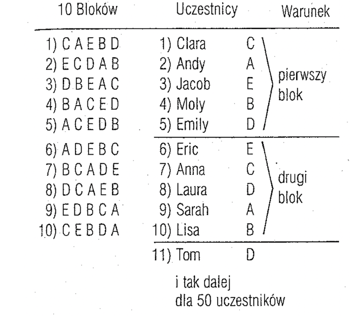

# Proste plany eksperymentalne

---

# Proste plany eksperymentalne
* ...czyli takie, w których jest **jeden czynnik** (może być na wielu poziomach)
* Plany grup niezależnych
* Plany z powtarzanymi pomiarami

---

# Plan grup niezależnych

* Dwie (lub więcej) grupy osób badanych, osobno dla każdego poziomu manipulacji zmiennej niezależnej
* Grupy różnią się od siebie **tylko pod względem manipulacji eksperymentalnej**
* Często występuje grupa kontrolna (brak manipulacji, manipulacja neutralna itd.)

---

# Plan grup niezależnych

* Jeżeli grupy badanych są podobne do siebie pod względem wszystkich ważnych cech na początku eksperymentu…
* …to manipulacja eksperymentalna spowodowała zmianę zmiennej zależnej
* Uwaga! Kluczowy jest **losowy dobór do grup**

---

# Losowy dobór do grup (random assignment)

* Każda osoba badana ma **taką samą szansę trafienia do każdej grupy badawczej**
* To nie to samo co losowy dobór próby (tj. losowy dobór osób badanych z populacji)!
* Dobór próby może być losowy, celowany, przypadkowy, kulośniegowy... wszystko jedno!
* Ważne jest, że dobór do poszczególnych grup eksperymentalnych jest losowy

---

# Jak zapewnić losowy dobór do grup?

* Rzut monetą i inne _stricte_ losowe procedury
* Pełna losowość gdy dobór każdej osoby jest niezależny od doboru innych osób
* Kłopot - potencjalnie nierównoliczne grupy
* Rozwiązanie - randomizacja w blokach (niespełniony warunek niezależności, ale w praktyce mało kto się tym przejmuje...)

---

# Randomizacja w blokach

---

# Inna strategia - dobór wiązany (matched groups)

* Jeśli chcemy dobrze kontrolować zmienną o charakterze różnic indywidualnych (np. wiek, płeć), możemy dobrać grupy równoważąc tą zmienną
* Przykładowa procedura - rekrutujemy N osób, ustawiamy od najmłodszej do najstarszej a następnie losujemy przydział do grup po kolei, w parach
* W ten sposób mamy dwie grupy z (prawie) identyczną strukturą wieku
* Jeśli jedna to grupa kontrolna, taką grupę nazywa się _matched controls_
* Zalety - łatwa kontrola danej zmiennej i zapewnienie losowości
* Wady - bardziej kłopotliwa rekrutacja, można stosować tylko do łatwych w pomiarze zmiennych