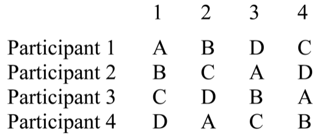

# Powtarzany pomiar

---

#  Plan z powtarzanymi pomiarami

* Każdy badany otrzymuje wszystkie manipulacje eksperymentalne
* Badany sam dla siebie jest kontrolą
* Na ogół jest wygodniejszy, wymaga mniej osób badanych i jest bardziej wrażliwy niż plan grup niezależnych
* ...ALE jest jeden problem

---

#  Efekt wprawy

* Sam fakt pomiaru danej zmiennej wpływa na osoby badane
* Przy powtarzanym pomiarze mamy zachwiany warunek utrzymywania stałych warunków eksperymentalnych
* Efektu wprawy nie da się wykluczyć, można go tylko zrównoważyć

---

# Inne oblicza efektu wprawy

* Efekt zmęczenia
* Efekt kontekstu

---

#  Efekt wprawy

* Pełny plan z powtarzanymi pomiarami: każdy badany bierze udział w każdym warunku kilka razy w różnej kolejności
* Niepełny plan z powtarzanymi pomiarami: różni badani mają różną kolejność warunków eksperymentalnych

---

#  Równoważenie efektu wprawy - plan pełny

* Randomizacja w blokach:
* Identycznie jak dla planu grup randomizowanych
* Bardzo skuteczna procedura
* Wymaga powtórzenia każdej „kolejności” kilka razy – wiele prób eksperymentalnych

---

# Randomizacja w blokach - przykład

* Powiedzmy, że mamy trzy poziomy jakiegoś czynnika - A, B, C
* Tworzymy losową listę permutacji: 
  * ACB
  * BCA
  * CAB
  * ACB
  * BAC 
* Badany otrzymuje kolejno manipulacje: ACBBCACABACBBAC
* Dla kolejnego badanego losujemy nową listę permutacji itd.

---

#  Równoważenie efektu wprawy - plan pełny

* Procedura ABBA:
* Dla dwóch warunków – najpierw prezentujemy AB, potem BA
* Dla trzech – najpierw ABC, potem CBA
* Skuteczna, o ile efekt wprawy jest liniowy 
* Pojawia się efekt antycypacji

---

#  Równoważenie efektu wprawy - plan niepełny

* Różne kolejności warunków eksperymentalnych u różnych osób
* Każdy warunek eksperymentalny powinien pojawić się jednakową ilość razy w każdej możliwej kolejności
* Wszystkie możliwe kolejności:
  * Wszystkie permutacje zbioru N-elementowego – N!
  * Każda permutacja dla równej liczby osób badanych

---

# Wszystkie możliwe kolejności - przykład

* Osoba 1 dostaje ABC
* Osoba 2 dostaje BAC
* Osoba 3 dostaje ACB
* Osoba 4 dostaje BCA
* Osoba 5 dostaje CAB
* Osoba 6 dostaje CBA
* Osoba 7 znowu dostaje ABC...

---

#  Równoważenie efektu wprawy - plan niepełny

* Wybrane kolejności:
    * Kwadrat łaciński
    * Rotacje losowej kolejności
    

---

#  Kwadraty łacińskie

---

#  Kwadraty łacińskie

---

#  Metoda rotacji

Wybieramy losowo kolejność i rotujemy ją o jedną pozycję w przód tyle razy, ile mamy elementów, np.:

1. ACBED
2. CBEDA
3. BEDAC
4. EDACB
4. DACBE

---

# Powtarzać czy nie powtarzać?

* Plan z powtarzanym pomiarem ma szereg zalet:
  * Szybszy
  * Tańszy
  * Potrzeba mniej uczestników
  * Pozwala lepiej kontrolować różnice indywidualne
* Ma też jedną wadę: efekt wprawy
* Czy więc robić eksperymenty z powtarzanym pomiarem czy w grupach niezależnych?
* Problem optymalizacji

---

# Kilka uwag o doborze próby

* W badaniach eksperymentalnych mniej ważny niż w korelacyjnych
* Uwaga na "osobowość ochotnika"! (Rosenthal & Rosnow, 1976). Ochotnicy są przeciętnie:
  * Bardziej zainteresowani tematem
  * Bardziej uspołecznieni
  * Lepiej wykształceni
  * Mają większą potrzebę akceptacji
  * Mają wyższe IQ
* Czy to kłopot? To zależy.