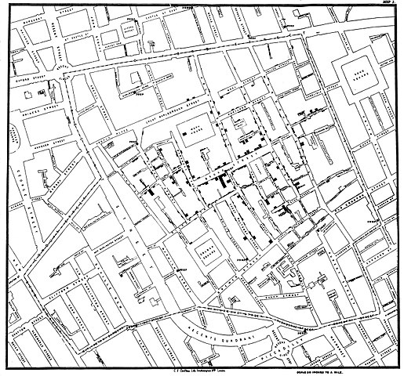

# Prosty podział wg dwóch kryteriów

* Czy to my manipulujemy zmienną niezależną?
* Czy to my kontrolujemy dobór do grup?

---

# Nie manipulujemy zmienną niezależną, nie kontrolujemy doboru do grup

* porównanie grup
* badania korelacyjne, np. związek między różnymi cechami osobowości
* plany:
  + badania poprzeczne
  + sukcesywnych prób niezależnych
  + badania podłużne
* Nie możemy wnioskować o zależności przyczynowo-skutkowej!

---

## Kontrolujemy zmienną niezależną, kontrolujemy dobór do grup

* Eksperyment "właściwy"
* Co się stanie, jeżeli źle dobierzemy osoby do grup i grupy wyjściowo będą się różnić?

---

## Manipulujemy zmienną niezależną, nie kontrolujemy doboru do grup

* Quasi-eksperymenty
* Plany szeregów czasowych
* Plany ABAB

---

# Quasi-eksperymenty

* Eksperymenty, w których z różnych przyczyn niespełniony jest warunek losowego doboru osób do grup
* Często używane wszędzie tam, gdzie niepraktyczne/nieetyczne jest zrobienie prawdziwego eksperymentu
* Np. porównanie wyników nauczania jakiegoś przedmiotu pomiędzy dwoma klasami w szkole
* Eksperyment Rodin i Langer 1977 (kwiatki w domu starców)

---

## Eksperymenty naturalne

* Manipulacji nie dokonuje eksperymentator tylko _"natura"_
* Warunek - osoby dotknięte manipulacją _"losowo"_
* Stosuje się tam, gdzie manipulacja jest niepraktyczna/nieetyczna
* Np. wpływ promieniowania na rozwój psychiczny dzieci

---

## Epidemia cholery w Londynie

---

## Quasi-eksperyment vs. eksperyment naturalany

* W quasi-eksperymencie manipuluje badacz, w eksperymencie nautralnym _"natura"_
* Oba plany badawcze **nie są prawdziwymi eksperymentami** - niespełniony jest warunek losowego doboru do grup
* Wielka zaleta - wysoka trafność ekologiczna

---

## Gdy nie kontrolujemy doboru do grup

* Nie mamy wpływu na zmienne zakłócające związane z charakterystyką badanych i ich historią
* W efekcie nie możemy w pełni przypisać obserwowanego efektu zmieniającym się poziomom zmiennej niezależnej

---

## Paradoks Simpsona - leczymy kamienie nerkowe

||Leczenie A|Leczenie B|
|:--|:-:|:-:|
|Ogółem|78% (273/350)|**83% (289/350)**|

---

## Paradoks Simpsona

||Leczenie A|Leczenie B|
|:--|:-:|:-:|
|Małe kamienie|**93% (81/87)**|87% (234/270)|
|Duże kamienie|**73% (192/263)**|69% (55/80)|
|Ogółem|78% (273/350)|**83% (289/350)**|

(Charig et al., 1986)

---

## Paradoks Simpsona

* Okazuje się, że małe kamienie lepiej się leczy niż duże!
* Technicznie: efekt wielkości kamieni jest silniejszy niż efekt leczenia